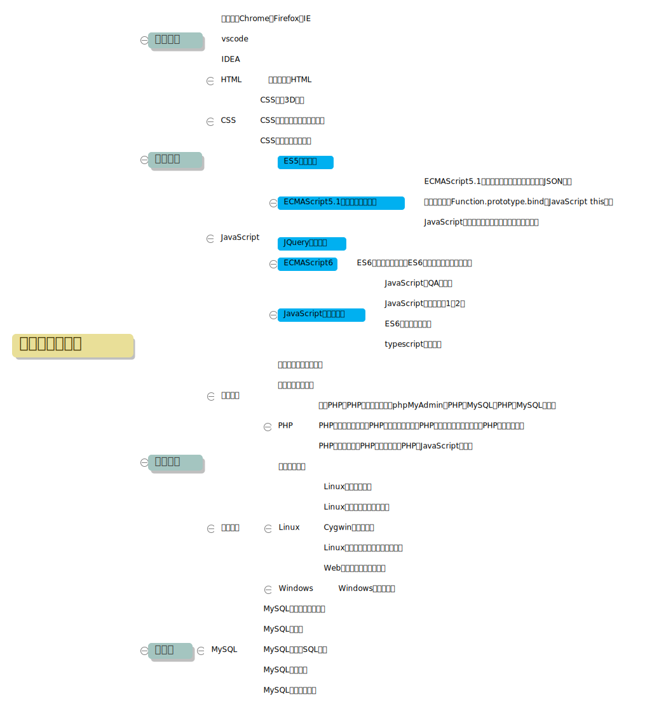

# 这是一灯学堂的笔记项目，详细的纪录每节课程的笔记。

## 预科班

第一部分是预科班的笔记内容，在正式开课之前需要全面预习和梳理的前端知识点。预科班课程中有部分讲课重复，所以梳理过程中，先按照课程体系梳理，然后按照知识体系梳理。

**下面是按照课程体系的思维导图**  

**下面是按照知识体系的思维导图**  
  
上图是知识体系思维导图的概要，详细内容请参照每一章内容的详细笔记  

** 各部分课程详细笔记
* [你不知道的html][1]
* [CSS基础与高级][2] *未完成*
* [ES5基础与核心知识][3]
* [ES6编程风格与精粹][4] *未完成*
* [PHP与MySQL入门到实践][5] *未完成*

[1]: https://github.com/Martin-Shao/yideng-note/blob/master/html-senior/exercises.md
[2]: https://github.com/Martin-Shao/yideng-note
[3]: https://github.com/Martin-Shao/yideng-note/blob/master/es5-senior/exercises.md
[4]: https://github.com/Martin-Shao/yideng-note/blob/master/es6-senior/exercises.md
[5]: https://github.com/Martin-Shao/yideng-note