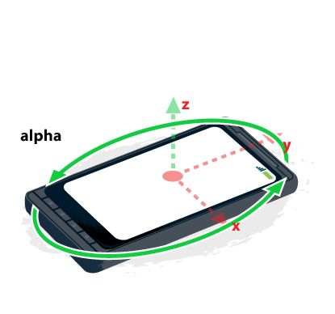
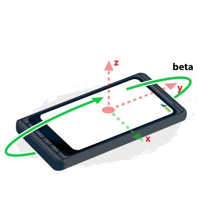
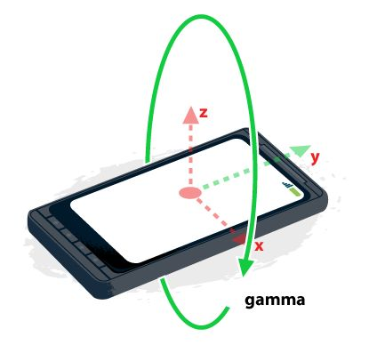

# CSS高级

## 3D技术在前端应用和发展

课程大纲
* HTML5陀螺仪
* CSS3 3D模型
* 结合Touch事件
* CSS 3D库
* JS类库

## 陀螺仪

陀螺仪又叫角速度传感器，是不同于加速度计（G-sensor）的，他的测量物理量是偏转、倾斜时的转动角速度。在手机上，仅用加速度计没办法测量或重构出完整的3D动作，测不到转动的动作的，G-sensor只能检测轴向的线性动作。但陀螺仪则可以对转动、偏转的动作做很好的测量，这样就可以精确分析判断出使用者的实际动作。而后根据动作，可以对手机做相应的操作！

设备方向定义了三种旋转：

Alpha：以Z轴为轴的旋转为alpha。其范围为0到360度，当前指向表示为z。
Beta：以X轴为轴的旋转为beta。其范围为-180到180度，当前指向表示为x。
Gamma：以Y轴为轴的旋转为gamma。其范围为-90到90度，当前指向表示为y。






### 获取罗盘校准

```js
window.addEventListener("compassneedscalibration", function (event) {
  showMessage('您的罗盘需要校准，请将设备沿数字8方向移动。');
  event.preventDefault();
}, true);
```

### 获取重力加速度

```js

```

### 重力加速度

### 摇一摇

## CSS 3D模型

### 球面投影

### 比较

### 效果

### 公式

### 效果11

美滋滋

### 淘宝造物节

## 集合Touch事件

## CSS高级实用技巧

css3开发常备核心技能

* 早起的双飞翼布局+CSS HACK
* 基于移动端的PX与REM转换兼容方案
* 弹性盒模型与Reset的选择
* 自制的CON-FONT与常用字体排版
* CSS代码检测与团队项目规范
* CSS绘制特殊图形 高级技巧
* BFC IFC GFC FFC

### 双飞翼布局

position
float
负边距
等高
盒模型
清除浮动

### 从双飞翼布局到CSS布局

作为全栈的伪前端工程师，一直以来对于CSS这块的知识都有所欠缺。但每次遇到样式问题也十分尴尬，
痛定思痛之后，决定把这块的知识彻底梳理出来。

学习布局是对于CSS知识整体运用的一种有效的方式。

CSS布局基础知识：定位、尺寸、浮动。

CSS中有个重要的概念就是定位：`position` ，掌握position属性值的用法和特性是十分有必要的。
总的来说，position属性有六个属性值：static、relative、absolute、fixed、sticky和inherit。
* static(默认)：元素框正常生成。块级元素生成一个矩形框，作为文档流的一部分；行内元素则会创建一个或多个行框，置于其父元素中。
* relative：元素框相对于之前正常文档流中的位置发生偏移，并且原先的位置仍然被占据。发生偏移的时候，可能会覆盖其他元素。
* absolute：元素框不再占有文档流位置，并且相对于包含块进行偏移(所谓的包含块就是最近一级外层元素position不为static的元素)
* fixed：元素框不再占有文档流位置，并且相对于视窗进行定位
* sticky：(这是css3新增的属性值)粘性定位，官方的介绍比较简单，或许你不能理解。其实，它就相当于relative和fixed混合。最初会被当作是relative，相对于原来的位置进行偏移；一旦超过一定阈值之后，会被当成fixed定位，相对于视口进行定位。

学习CSS可以借助一下几个网站：W3school
* [W3school](http://www.w3school.com.cn/cssref/pr_class_position.asp)
* [MDN](https://developer.mozilla.org/en-US/docs/Web/CSS/position)

偏移量：top、right、bottom、left四个属性。

这里的尺寸指的是盒模型的尺寸。