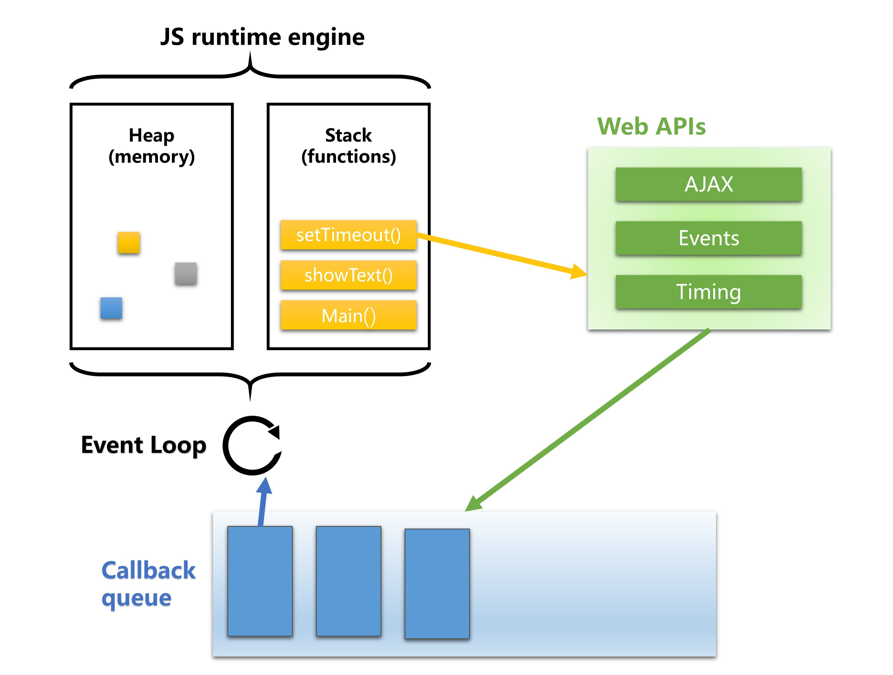
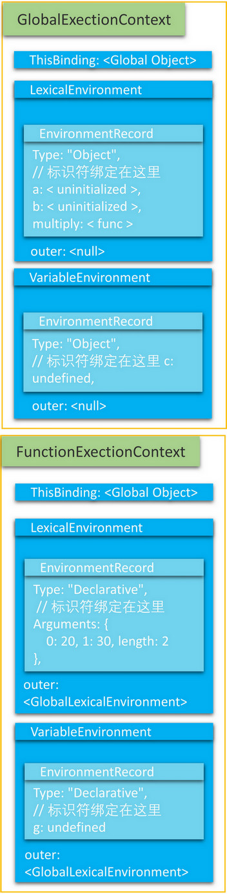

# 理解JavaScript 中的执行上下文和执行栈

> 本文引自**阅文前端**  
> 原文地址 [Understanding Execution Context and Execution Stack in Javascript](https://blog.bitsrc.io/understanding-execution-context-and-execution-stack-in-javascript-1c9ea8642dd0)  
> 译文地址 [理解 Javascript 执行上下文和执行栈](https://github.com/yued-fe/y-translation/blob/master/en/understanding-execution-context-and-execution-stack-in-javascript.md)

在掘金上看到的这篇文章，对于执行上下文和执行栈的解读已经十分详细，做了一回伸手党。

如果你是一名 JavaScript 开发者，或者想要成为一名 JavaScript 开发者，那么你必须知道 JavaScript 程序内部的执行机制。理解执行上下文和执行栈同样有助于理解其他的 JavaScript 概念如提升机制、作用域和闭包等。

正确理解执行上下文和执行栈的概念将有助于你成为一名更好的 JavaScript 开发人员。

废话不多说，让我们切入正题。

## 什么是执行上下文

简而言之，执行上下文就是当前 JavaScript 代码被解析和执行时所在环境的抽象概念， JavaScript 中运行任何的代码都是在执行上下文中运行。

执行上下文的类型
执行上下文总共有三种类型：

* **全局执行上下文**： 这是默认的、最基础的执行上下文。不在任何函数中的代码都位于全局执行上下文中。它做了两件事：1. 创建一个全局对象，在浏览器中这个全局对象就是 window 对象。2. 将 `this` 指针指向这个全局对象。一个程序中只能存在一个全局执行上下文。
* **函数执行上下文**： 每次调用函数时，都会为该函数创建一个新的执行上下文。每个函数都拥有自己的执行上下文，但是只有在函数被调用的时候才会被创建。一个程序中可以存在任意数量的函数执行上下文。每当一个新的执行上下文被创建，它都会按照特定的顺序执行一系列步骤，具体过程将在本文后面讨论。
* **Eval 函数执行上下文**： 运行在 `eval` 函数中的代码也获得了自己的执行上下文，但由于 Javascript 开发人员不常用 `eval` 函数，所以在这里不再讨论。

## 执行栈

关于执行栈，这其实并不是JavaScript专有的知识 ，计算机语言的执行几乎都是依赖于执行栈的。  

> 执行栈是计算机科学中存储有关正在运行的子程序的消息的栈。经常被用于存放子程序的返回地址。在调用任何子程序时，主程序都必须暂存子程序运行完毕后应该返回到的地址。因此，如果被调用的子程序还要调用其他的子程序，其自身的返回地址就必须存入执行栈，在其自身运行完毕后再行取回。

**功能**  
执行栈的主要功能是存放返回地址。除此之外，执行栈还用于存放：
* 本地变量：子程序的变量可以存入调用栈，这样可以达到不同子程序间变量分离开的作用。
* 参数传递：如果寄存器不足以容纳子程序的参数，可以在调用栈上存入参数。
* 环境传递：有些语言（如Pascal与Ada）支持“多层子程序”，即子程序中可以利用主程序的本地变量。这些变量可以通过调用栈传入子程序。

关于执行栈的称呼或者说别名有很多种：
* 执行栈（Execution stack）
* 调用栈（Call stack）
* 控制栈（Control stack）
* 运行时栈（Run-time stack）
* 机器栈（Machine stack）

以上名词所要表达的都是一个意思，下文中指定使用 **执行栈** 表达

JavaScript执行栈示意图  


在介绍JavaScript执行栈之前，首先明确几个概念：
* `EC`：函数执行环境（或执行上下文），Execution Context
* `ECS`：执行环境栈（执行栈），Execution Context Stack
* `VO`：变量对象，Variable Object
* `AO`：活动对象，Active Object
* `GO`：全局对象，Global Object
* `scope chain`：作用域链

JavaScript执行栈，在其他编程语言中也被叫做调用栈，具有 LIFO（后进先出）结构，**用于存储在代码执行期间创建的所有执行上下文**。

当 JavaScript 引擎首次读取你的脚本时，它会创建一个全局执行上下文并将其推入当前的执行栈。每当发生一个函数调用，引擎都会为该函数创建一个新的执行上下文并将其推到当前执行栈的顶端。

引擎会运行执行上下文在执行栈顶端的函数，当此函数运行完成后，其对应的执行上下文将会从执行栈中弹出，上下文控制权将移到当前执行栈的下一个执行上下文。

让我们通过下面的代码示例来理解这一点：

```js
let a = 'Hello World!';

function first() {  
  console.log('Inside first function');  
  second();  
  console.log('Again inside first function');  
}

function second() {  
  console.log('Inside second function');  
}

first();  
console.log('Inside Global Execution Context');
```


当上述代码在浏览器中加载时，JavaScript 引擎会创建一个全局执行上下文并且将它推入当前的执行栈。当调用 `first()` 函数时，JavaScript 引擎为该函数创建了一个新的执行上下文并将其推到当前执行栈的顶端。

当在 `first()` 函数中调用 `second()` 函数时，Javascript 引擎为该函数创建了一个新的执行上下文并将其推到当前执行栈的顶端。当 `second()` 函数执行完成后，它的执行上下文从当前执行栈中弹出，上下文控制权将移到当前执行栈的下一个执行上下文，即 `first()` 函数的执行上下文。

当 `first()` 函数执行完成后，它的执行上下文从当前执行栈中弹出，上下文控制权将移到全局执行上下文。一旦所有代码执行完毕，Javascript 引擎把全局执行上下文从执行栈中移除。

## 执行上下文是如何被创建的

到目前为止，我们已经看到了 JavaScript 引擎如何管理执行上下文，现在就让我们来理解 JavaScript 引擎是如何创建执行上下文的。

执行上下文分两个阶段创建：**1）创建阶段**； **2）执行阶段**

### 创建阶段

在任意的 JavaScript 代码被执行前，执行上下文处于创建阶段。在创建阶段中总共发生了三件事情：

1. 确定 `this` 的值，也被称为 **This Binding**。
2. **LexicalEnvironment（词法环境）** 组件被创建。
3. **VariableEnvironment（变量环境）** 组件被创建。

因此，执行上下文可以在概念上表示如下：

```js
ExecutionContext = {  
  ThisBinding = <this value>,  
  LexicalEnvironment = { ... },  
  VariableEnvironment = { ... },  
}
```

#### This Binding:

在全局执行上下文中，this 的值指向全局对象，在浏览器中，`this` 的值指向 window 对象。

在函数执行上下文中，this 的值取决于函数的调用方式。如果它被一个对象引用调用，那么 `this` 的值被设置为该对象，否则 `this` 的值被设置为全局对象或 `undefined`（严格模式下）。例如：

```js
let person = {  
  name: 'peter',  
  birthYear: 1994,  
  calcAge: function() {  
    console.log(2018 - this.birthYear);  
  }  
}

person.calcAge();
// 'this' 指向 'person', 因为 'calcAge' 是被 'person' 对象引用调用的。

let calculateAge = person.calcAge;  
calculateAge();  
// 'this' 指向全局 window 对象,因为没有给出任何对象引用
```

#### 词法环境（Lexical Environment）

[官方 ES6](http://ecma-international.org/ecma-262/6.0/) 文档将词法环境定义为：
> 词法环境是一种规范类型，基于 ECMAScript 代码的词法嵌套结构来定义标识符与特定变量和函数的关联关系。词法环境由环境记录（environment record）和可能为空引用（null）的外部词法环境组成。

简而言之，词法环境是一个包含**标识符变量映射**的结构。（这里的**标识符**表示变量/函数的名称，**变量**是对实际对象【包括函数类型对象】或原始值的引用）

在词法环境中，有两个组成部分：（1）**环境记录（environment record）** （2）**对外部环境的引用**

1. 环境记录是存储变量和函数声明的实际位置。
2. 对外部环境的引用意味着它可以访问其外部词法环境。

**词法环境**有两种类型：

* **全局环境**（在全局执行上下文中）是一个没有外部环境的词法环境。全局环境的外部环境引用为 null。它拥有一个全局对象（window 对象）及其关联的方法和属性（例如数组方法）以及任何用户自定义的全局变量，this 的值指向这个全局对象。

* **函数环境**，用户在函数中定义的变量被存储在环境记录中。对外部环境的引用可以是全局环境，也可以是包含内部函数的外部函数环境。

**注意**：  对于**函数环境**而言，**环境记录** 还包含了一个 `arguments` 对象，该对象包含了索引和传递给函数的参数之间的映射以及传递给函数的参数的**长度（数量）**。例如，下面函数的 `arguments` 对象如下所示：

```js
function foo(a, b) {  
  var c = a + b;  
}  
foo(2, 3);

// arguments 对象  
Arguments: {0: 2, 1: 3, length: 2},
```

**环境记录** 同样有两种类型（如下所示）：

* 声明性环境记录 存储变量、函数和参数。一个函数环境包含声明性环境记录。
* 对象环境记录 用于定义在全局执行上下文中出现的变量和函数的关联。全局环境包含对象环境记录。

抽象地说，词法环境在伪代码中看起来像这样：

```js
GlobalExectionContext = {  
  LexicalEnvironment: {  
    EnvironmentRecord: {  
      Type: "Object",  
      // 标识符绑定在这里 
    outer: <null>  
  }  
}

FunctionExectionContext = {  
  LexicalEnvironment: {  
    EnvironmentRecord: {  
      Type: "Declarative",  
      // 标识符绑定在这里 
    outer: <Global or outer function environment reference>  
  }  
}
```

**变量环境**:

它也是一个词法环境，其 `EnvironmentRecord` 包含了由 **VariableStatements** 在此执行上下文创建的绑定。

如上所述，变量环境也是一个词法环境，因此它具有上面定义的词法环境的所有属性。

在 ES6 中，**LexicalEnvironment** 组件和 **VariableEnvironment** 组件的区别在于前者用于存储函数声明和变量（ `let` 和 `const` ）绑定，而后者仅用于存储变量（ `var` ）绑定。

让我们结合一些代码示例来理解上述概念：

```js
let a = 20;  
const b = 30;  
var c;

function multiply(e, f) {  
 var g = 20;  
 return e * f * g;  
}

c = multiply(20, 30);
```

执行上下文如下所示：

```js
GlobalExectionContext = {

  ThisBinding: <Global Object>,

  LexicalEnvironment: {  
    EnvironmentRecord: {  
      Type: "Object",  
      // 标识符绑定在这里  
      a: < uninitialized >,  
      b: < uninitialized >,  
      multiply: < func >  
    }  
    outer: <null>  
  },

  VariableEnvironment: {  
    EnvironmentRecord: {  
      Type: "Object",  
      // 标识符绑定在这里  
      c: undefined,  
    }  
    outer: <null>  
  }  
}

FunctionExectionContext = {  

  ThisBinding: <Global Object>,

  LexicalEnvironment: {  
    EnvironmentRecord: {  
      Type: "Declarative",  
      // 标识符绑定在这里  
      Arguments: {0: 20, 1: 30, length: 2},  
    },  
    outer: <GlobalLexicalEnvironment>  
  },

  VariableEnvironment: {  
    EnvironmentRecord: {  
      Type: "Declarative",  
      // 标识符绑定在这里  
      g: undefined  
    },  
    outer: <GlobalLexicalEnvironment>  
  }  
}
```



注意：  只有在遇到函数 `multiply` 的调用时才会创建函数执行上下文。

你可能已经注意到了 `let` 和 `const` 定义的变量没有任何与之关联的值，但 `var` 定义的变量设置为 `undefined。`

这是因为在创建阶段，代码会被扫描并解析变量和函数声明，其中函数声明存储在环境中，而变量会被设置为 `undefined`（在 `var` 的情况下）或保持未初始化（在 `let` 和 `const` 的情况下）。

这就是为什么你可以在声明之前访问 `var` 定义的变量（尽管是 `undefined` ），但如果在声明之前访问 `let` 和 `const` 定义的变量就会提示引用错误的原因。

这就是我们所谓的变量提升。

执行阶段
这是整篇文章中最简单的部分。在此阶段，完成对所有变量的分配，最后执行代码。

注： 在执行阶段，如果 Javascript 引擎在源代码中声明的实际位置找不到 `let` 变量的值，那么将为其分配 `undefined` 值。

总结
我们已经讨论了 JavaScript 内部是如何执行的。虽然你没有必要学习这些所有的概念从而成为一名出色的 JavaScript 开发人员，但对上述概念的理解将有助于你更轻松、更深入地理解其他概念，如提升、域和闭包等。

今天主要是研究JavaScript执行栈和执行上下文，并且整理成文章。