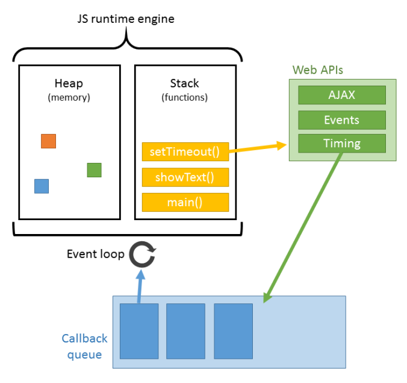
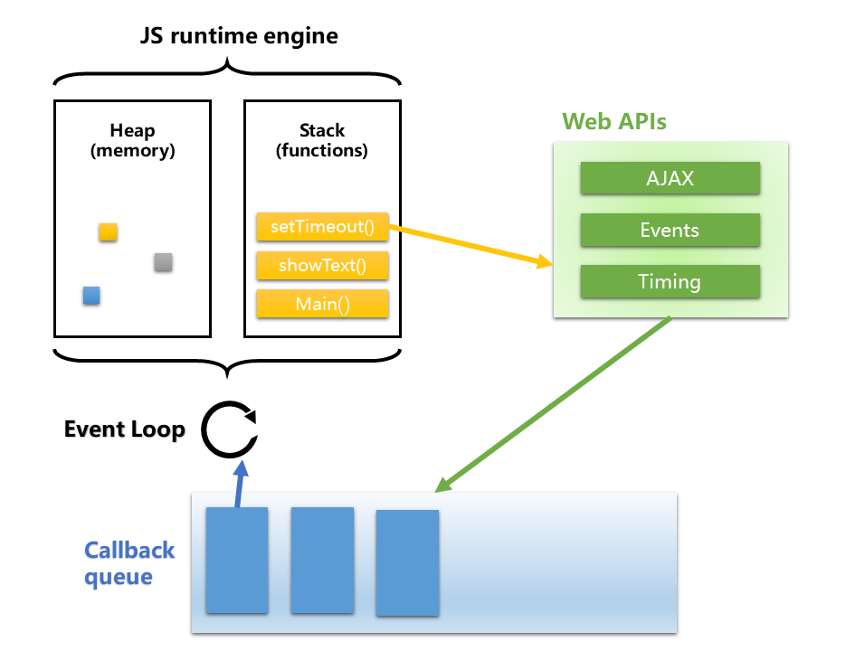

# JavaScript与执行栈

JavaScript执行机制的探索离不开三个核心要素：执行上下文、执行环境栈、作用域链。

学习和使用JavaScript这门语言眼看着也有了两年时光，一直以来对于JavaScript的运行机制不甚了解，  
一方面是自己对于语言底层的东西很感兴趣（作为一个非计算机专业同学的坚持），另一方面，这些知识也给开发带来更多的助力（虽然表面上看上去没怎么用到。）

首先明确几个概念：
* `EC`：函数执行环境（或执行上下文），Execution Context
* `GEC`：全局执行环境（或全局执行上下文），Global Execution Context
* `ECS`：执行环境栈，Execution Context Stack
* `VO`：变量对象，Variable Object
* `AO`：活动对象，Active Object
* `GO`：全局对象，Global Object
* `scope chain`：作用域链
* `Lexical Environment`：词法环境
* `Variable Environment`：变量环境
* `Environment Record`：环境记录
* `outer Lexical Environment`：外部词法环境
* `Object Environment Record`：对象环境记录
* `Declarative Environment Record`：声明性环境记录
* `Function Environment Record`：函数环境记录
* `Global Environment Records`：全局环境记录
* `Module Environment Record`：模块环境记录
* ``：
* ``：
* ``：
* ``：
* ``：

## 一切从执行栈开始

关于执行栈，这其实并不是JavaScript专有的知识 ，计算机语言的执行几乎都是依赖于执行栈的。

> 执行栈是计算机科学中存储有关正在运行的子程序的消息的栈。经常被用于存放子程序的返回地址。在调用任何子程序时，主程序都必须暂存子程序运行完毕后应该返回到的地址。因此，如果被调用的子程序还要调用其他的子程序，其自身的返回地址就必须存入执行栈，在其自身运行完毕后再行取回。在递归程序中，每一层次递归都必须在执行栈上增加一条地址，因此如果程序出现无限递归（或仅仅是过多的递归层次），执行栈就会产生栈溢出。

关于执行栈的称呼或者说别名有很多种：
* 执行栈（Execution stack）
* 调用栈（Call stack）
* 控制栈（Control stack）
* 运行时栈（Run-time stack）
* 机器栈（Machine stack）

以上名词所要表达的都是一个意思，下文中指定使用 **执行栈** 表达

JavaScript执行栈示意图  



### **功能**

调用栈的主要功能是存放返回地址。除此之外，调用栈还用于存放：
* 本地变量：子程序的变量可以存入调用栈，这样可以达到不同子程序间变量分离开的作用。
* 参数传递：如果寄存器不足以容纳子程序的参数，可以在调用栈上存入参数。
* 环境传递：有些语言（如Pascal与Ada）支持“多层子程序”，即子程序中可以利用主程序的本地变量。这些变量可以通过调用栈传入子程序。

## JavaScript执行上下文、函数堆栈、提升的概念


```js
let a = 20;  
const b = 30;  
var c;

function multiply(e, f) {  
 var g = 20;  
 return e * f * g;  
}
// 这是标记
multiply(20, 30);
```

```js
ExecutionContext = {  
  ThisBinding = <this value>,
  LexicalEnvironment = { ... },  
  VariableEnvironment = { ... },  
}
```

```js
GlobalExectionContext = {  
  LexicalEnvironment: {  
    EnvironmentRecord: {  
      Type: "Object",  
      // 标识符绑定在这里 
    outer: <null>  
  }  
}
```

```js
FunctionExectionContext = {  
  LexicalEnvironment: {  
    EnvironmentRecord: {  
      Type: "Declarative",  
      // 标识符绑定在这里 
    outer: <Global or outer function environment reference>  
  }  
}
```

```js
let a = 20;  
const b = 30;  
var c;

function multiply(e, f) {  
 var g = 20;  
 return e * f * g;  
}

c = multiply(20, 30);
```
LexicalEnvironment 组件和 VariableEnvironment 组件的区别在于前者用于存储函数声明和变量（ let 和 const ）绑定，而后者仅用于存储变量（ var ）绑定。
```js
GlobalExectionContext = {

  ThisBinding: <Global Object>,

  LexicalEnvironment: {  
    EnvironmentRecord: {  
      Type: "Object",  
      // 标识符绑定在这里  
      a: < uninitialized >,  
      b: < uninitialized >,  
      multiply: < func >  
    }  
    outer: <null>  
  },

  VariableEnvironment: {  
    EnvironmentRecord: {  
      Type: "Object",  
      // 标识符绑定在这里  
      c: undefined,  
    }  
    outer: <null>  
  }  
}
```

```js
FunctionExectionContext = {  
   
  ThisBinding: <Global Object>,

  LexicalEnvironment: {  
    EnvironmentRecord: {  
      Type: "Declarative",  
      // 标识符绑定在这里  
      Arguments: {0: 20, 1: 30, length: 2},  
    },  
    outer: <GlobalLexicalEnvironment>  
  },

  VariableEnvironment: {  
    EnvironmentRecord: {  
      Type: "Declarative",  
      // 标识符绑定在这里  
      g: undefined  
    },  
    outer: <GlobalLexicalEnvironment>  
  }  
}
```

```js
// 全局词法环境
GlobalEnvironment = {
    outer: null, // 全局环境的外部环境引用为null
    // 全局环境记录，抽象为一个声明式环境记录和一个对象式环境记录的封装
    GlobalEnvironmentRecord: {
        // 全局this绑定值指向全局对象，即ObjectEnvironmentRecord的binding object
        [[GlobalThisValue]]: ObjectEnvironmentRecord[[BindingObject]],
        // 声明式环境记录，全局除了函数和var，其他声明绑定于此
        DeclarativeEnvironmentRecord: {
            y: 20,
            z: 30,
            Person: <<class>>
        },
        // 对象式环境记录的，绑定对象为全局对象，故其中的绑定可以通过访问全局对象的属性来获得
        ObjectEnvironmentRecord: {
            // 全局函数声明和var声明
            x: 10,
            foo: <<function>>,
            // 内置全局属性
            isNaN: <<function>>,
            isFinite: <<function>>,
            parseInt: <<function>>,
            parseFloat: <<function>>,
            Array: <<construct function>>,
            Object: <<construct function>>
            // 其他内置全局属性不一一列举
        }
    }
}
 
// foo函数词法环境
fooFunctionEnviroment = {
    outer: GlobalEnvironment, // 外部词法环境引用指向全局环境
    FunctionEnvironmentRecord: {
        [[ThisValue]]: GlobalEnvironment, // foo函数全局调用，故this绑定指向全局环境
        // 其他函数代码内的绑定
        a: 10
    }
}
```

