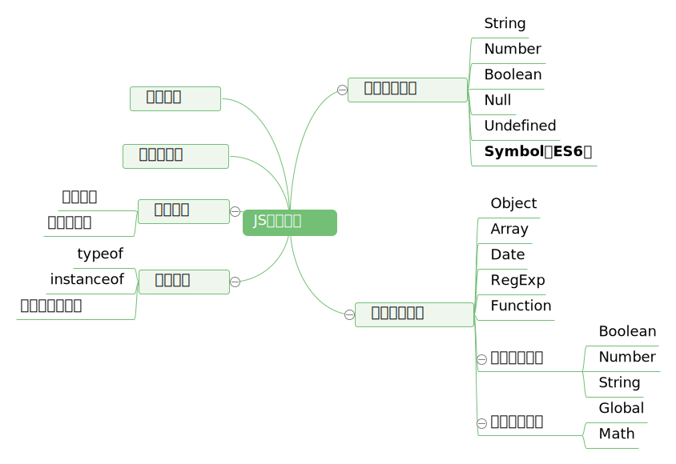
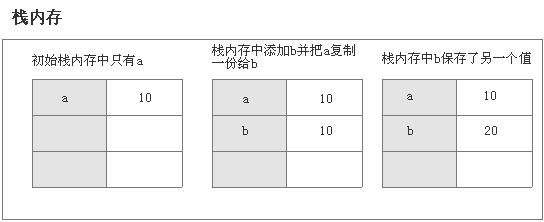
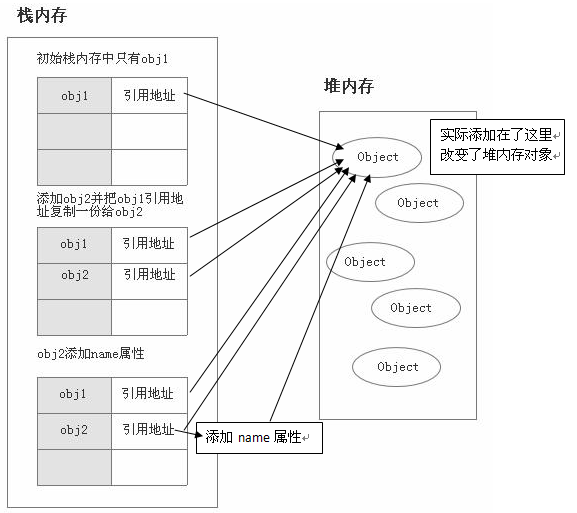

# JavaScript基础之变量类型

## JavaScript变量类型思维导图



## 概述

> ECMAScript包括两个不同类型的值：基本数据类型和引用数据类型。
> 基本数据类型指的是简单的数据段，引用数据类型指的是有多个值构成的对象。
> 当我们把变量赋值给一个变量时，解析器首先要确认的就是这个值是基本类型值还是引用类型值。
> 到目前为止，我们看到的大多数引用类型值都是Object类型的实例。  
><p align="right"> -------《JavaScript高级程序设计》</p>

## 常见的基本数据类型

**Number、String 、Boolean、Null和Undefined。**
基本数据类型是按值访问的，因为可以直接操作保存在变量中的实际值。示例：

``` js
  var a = 10
  var b = a;
  b = 20;
  console.log(a); // 10值
```

上面，b获取的是a值得一份拷贝，虽然，两个变量的值相等，但是两个变量保存了两个不同的基本数据类型值。
b只是保存了a复制的一个副本。所以，b的改变，对a没有影响。
下图演示了这种基本数据类型赋值的过程：



常见的引用类型数据
也就是对象类型Object type，比如：Object 、Array 、Function 、Data等。  
javascript的引用数据类型是保存在堆内存中的对象。与其他语言的不同是，你不可以直接访问堆内存空间中的位置和操作堆内存空间。只能操作对象在栈内存中的引用地址。  
所以，引用类型数据在栈内存中保存的实际上是对象在堆内存中的引用地址。通过这个引用地址可以快速查找到保存中堆内存中的对象。

``` js
　　var obj1 = new Object();
　　var obj2 = obj1;
　　obj2.name = "我有名字了";
　　console.log(obj1.name); // 我有名字了
```

说明这两个引用数据类型指向了同一个堆内存对象。obj1赋值给onj2，实际上这个堆内存对象在栈内存的引用地址复制了一份给了obj2，  
但是实际上他们共同指向了同一个堆内存对象。实际上改变的是堆内存对象。
下面我们来演示这个引用数据类型赋值过程：



## 总结区别

### A.声明变量时不同的内存分配：

1. 原始值：存储在栈（stack）中的简单数据段，也就是说，它们的值直接存储在变量访问的位置。这是因为这些原始类型占据的空间是固定的，所以可将他们存储在较小的内存区域 – 栈中。这样存储便于迅速查寻变量的值。
2. 引用值：存储在堆（heap）中的对象，也就是说，存储在变量处的值是一个指针（point），指向存储对象的内存地址。
3. 这是因为：引用值的大小会改变，所以不能把它放在栈中，否则会降低变量查寻的速度。相反，放在变量的栈空间中的值是该对象存储在堆中的地址。地址的大小是固定的，所以把它存储在栈中对变量性能无任何负面影响。

### B.不同的内存分配机制也带来了不同的访问机制

1. 在javascript中是不允许直接访问保存在堆内存中的对象的，所以在访问一个对象时，
2. 首先得到的是这个对象在堆内存中的地址，然后再按照这个地址去获得这个对象中的值，这就是传说中的按引用访问。
3. 而原始类型的值则是可以直接访问到的。

### C.复制变量时的不同

1. 原始值：在将一个保存着原始值的变量复制给另一个变量时，会将原始值的副本赋值给新变量，此后这两个变量是完全独立的，他们只是拥有相同的value而已。
2. 引用值：在将一个保存着对象内存地址的变量复制给另一个变量时，会把这个内存地址赋值给新变量，
也就是说这两个变量都指向了堆内存中的同一个对象，他们中任何一个作出的改变都会反映在另一个身上。
（这里要理解的一点就是，复制对象时并不会在堆内存中新生成一个一模一样的对象，只是多了一个保存指向这个对象指针的变量罢了）。多了一个指针

### D.参数传递的不同（把实参复制给形参的过程）

首先我们应该明确一点：**ECMAScript中所有函数的参数都是按值来传递的。**  
但是为什么涉及到原始类型与引用类型的值时仍然有区别呢？还是因为内存分配时的差别。 　
1. 原始值：只是把变量里的值传递给参数，之后参数和这个变量互不影响。
2. 引用值：对象变量它里面的值是这个对象在堆内存中的内存地址，这一点你要时刻铭记在心！
因此它传递的值也就是这个内存地址，这也就是为什么函数内部对这个参数的修改会体现在外部的原因了，因为它们都指向同一个对象。

## null和undefined区别

在JavaScript中存在这样两种原始类型:Null与Undefined。这两种类型常常会使JavaScript的开发人员产生疑惑，在什么时候是Null，什么时候又是Undefined?  
Undefined类型只有一个值，即undefined。当声明的变量还未被初始化时，变量的默认值为undefined。  
Null类型也只有一个值，即null。null用来表示尚未存在的对象，常用来表示函数企图返回一个不存在的对象。

``` js
var oValue;  
console.info(oValue == undefined); //output "true"  
```

这段代码显示为true,代表oVlaue的值即为undefined，因为我们没有初始化它。

``` js 
console.info(null == document.getElementById('notExistElement'));  
```

当页面上不存在id为"notExistElement"的DOM节点时，这段代码显示为"true"，因为我们尝试获取一个不存在的对象。

``` js
alert(typeof undefined); //output "undefined"  
alert(typeof null); //output "object"  
```

第一行代码很容易理解，undefined的类型为Undefined；第二行代码却让人疑惑，为什么null的类型又是Object了呢？其实这是JavaScript最初实现的一个错误，后来被ECMAScript沿用下来。在今天我们可以解释为，null即是一个不存在的对象的占位符，但是在实际编码时还是要注意这一特性。

``` js
alert(null == undefined); //output "true"  
```

ECMAScript认为undefined是从null派生出来的，所以把它们定义为相等的。但是，如果在一些情况下，我们一定要区分这两个值，那应该怎么办呢？可以使用下面的两种方法。

``` js
alert(null === undefined); //output "false"  
alert(typeof null == typeof undefined); //output "false"  
```

使用typeof方法在前面已经讲过，null与undefined的类型是不一样的，所以输出"false"。而===代表绝对等于，在这里null === undefined输出false。

## 变量