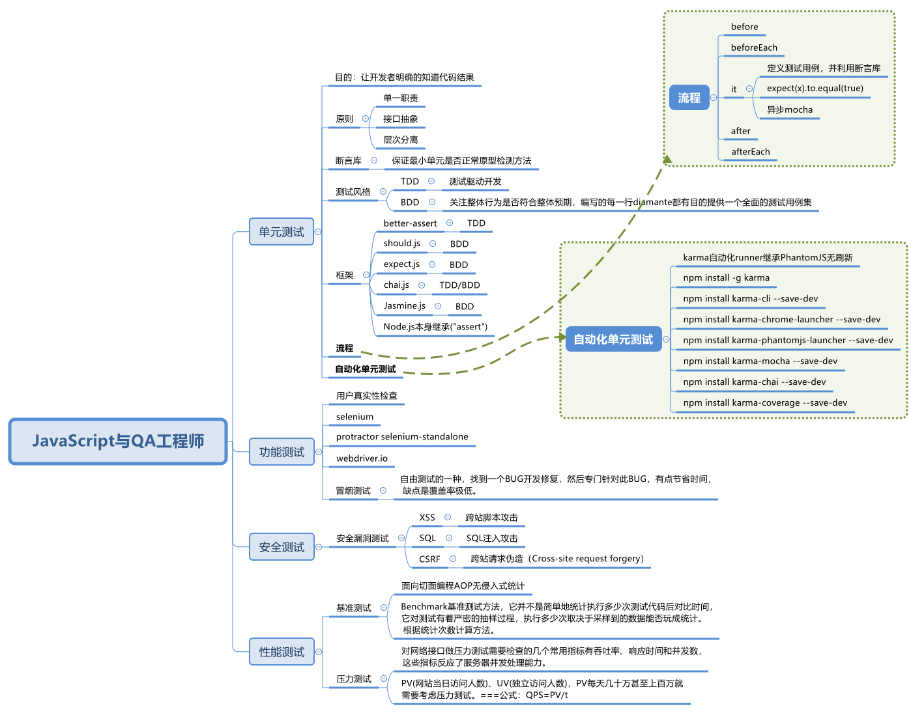

# JavaScript与QA工程师

作为前端工程师来说，测试必不可少的环节，但却又是很多开发的同学容易忽视的环节。  
本片文文章将带领同学们由浅入深的学习前端测试相关知识。

首先是思维导图

## 为什么要做单元测试

* 正确性：测试可以验证代码的正确性，在上线前做到心里有底
* 自动化：当然手动也可以测试，通过console可以打印出内部信息，但是这是一次性的事情，下次测试还需要从头再来，效率不能得到保证。通过编写测试用例，可以做到一次编写，多次运行。
* 解释性：测试用例用于测试接口、模块的重要性，那么在测试用例中就会涉及如何使用这些API。其他开发人员如果使用这些API，那阅读测试用例是一种很好地途径，有时比文档说明更清晰。
* 驱动开发，指导设计：代码被测试的前提是代码本身的可测试性，那么要保证代码的可测试性，就需要在开发中注意API的设计，TDD将测试前移就是起到这么一个作用。
* 保证重构：互联网行业产品迭代速度很快，迭代后必然存在diamante重构的过程，那怎么才能保证重构后代码的质量呢？有测试用例做后盾，就可以大胆地进行重构。

## 如何写单元测试用例

* 测试代码时，只考虑测试，不考虑内部实现
* 数据尽量模拟现实，越靠近现实越好
* 充分考虑数据的边界条件
* 对重点、复杂、核心代码，重点测试
* 利用AOP(beforeEach、afterEach),减少测试代码数量，避免无用功能
* 测试、功能开发相结合，有利于设计和代码重构

## TDD（Test-driven development）：

其基本思路是通过测试来推动整个开发的进行。

单元测试的首要目的不是为了能够编写出大覆盖率的全部通过的测试代码，而是需要从使用者(调用者)的角度出发，尝试函数逻辑的各种可能性，进而辅助性增强代码质量

测试是手段而不是目的。测试的主要目的不是证明代码正确，而是帮助发现错误，包括低级的错误

测试要快。快速运行、快速编写

测试代码保持简洁

不会忽略失败的测试。一旦团队开始接受1个测试的构建失败，那么他们渐渐地适应2、3、4或者更多的失败。在这种情况下，测试集就不再起作用

需要注意的是：

一定不能误解了TDD的核心目的！

测试不是为了覆盖率和正确率

而是作为实例，告诉开发人员要编写什么代码

红灯（代码还不完善，测试挂）-> 绿灯（编写代码，测试通过）-> 重构（优化代码并保证测试通过）

TDD的过程是：

需求分析，思考实现。考虑如何“使用”产品代码，是一个实例方法还是一个类方法，是从构造函数传参还是从方法调用传参，方法的命名，返回值等。这时其实就是在做设计，而且设计以代码来体现。此时测试为红

实现代码让测试为”绿灯“

重构，然后重复测试

最终符合所有要求即：

每个概念都被清晰的表达

代码中无自我重复

没有多余的东西

通过测试

## BDD(Behavior-driven development)：

行为驱动开发（BDD），重点是通过与利益相关者（简单说就是客户）的讨论，取得对预期的软件行为的认识，其重点在于沟通

BDD过程是：

从业务的角度定义具体的，以及可衡量的目标

找到一种可以达到设定目标的、对业务最重要的那些功能的方法

然后像故事一样描述出一个个具体可执行的行为。其描述方法基于一些通用词汇，这些词汇具有准确无误的表达能力和一致的含义。例如，expect, should, assert

寻找合适语言及方法，对行为进行实现

测试人员检验产品运行结果是否符合预期行为。最大程度的交付出符合用户期望的产品，避免表达不一致带来的问题