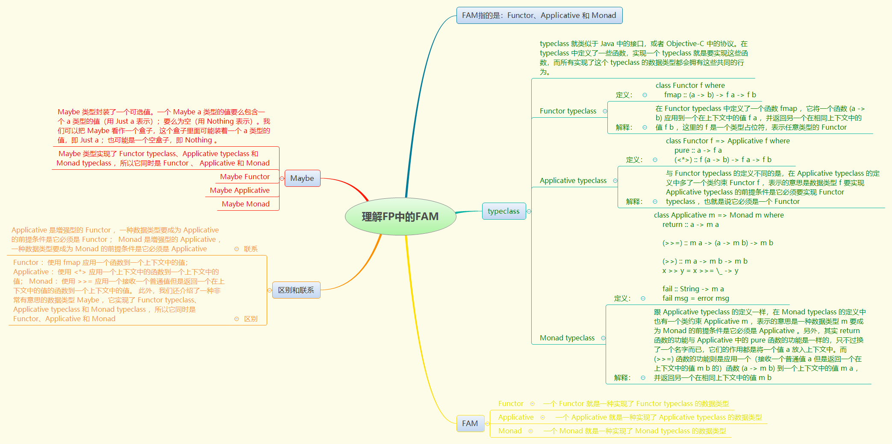
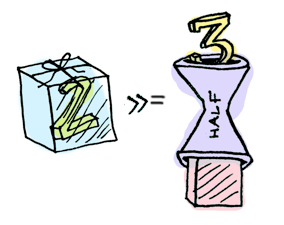

# FP编程进阶之——Functor、Applicative 和 Monad

 

`Functor` `、Applicative` 和 `Monad` 是函数式编程语言中三个非常重要的概念，尤其是 `Monad` ，难倒了不知道多少英雄好汉。事实上，它们的概念是非常简单的，但是却很少有文章能够将它们描述清楚，往往还适得其反，越描越黑。与其它文章不同的是，本文将从结论出发，层层深入，一步步为你揭开它们的神秘面纱。

**说明**：本文中的主要代码为 Haskell 语言，它是一门纯函数式的编程语言。其中，具体的语法细节，我们不需要太过关心，因为这并不影响你对本文的理解。

结论
关于 `Functor` `、Applicative` 和 `Monad` 的概念，其实各用一句话就可以概括：

1. 一个 `Functor` 就是一种实现了 `Functor typeclass` 的数据类型；
2. 一个 `Applicative` 就是一种实现了 `Applicative typeclass` 的数据类型；
3. 一个 `Monad` 就是一种实现了 `Monad typeclass` 的数据类型。
当然，你可能会问那什么是 `typeclass` 呢？我想当你在看到**实现**二字的时候，就应该已经猜到了：

> A typeclass is a sort of interface that defines some behavior. If a type is a part of a typeclass, that means that it supports and implements the behavior the typeclass describes. A lot of people coming from OOP get confused by typeclasses because they think they are like classes in object oriented languages. Well, they’re not. You can think of them kind of as Java interfaces, only better.

是的， `typeclass` 就类似于 `Java` 中的接口，或者 `Objective-C` 中的协议。在 `typeclass` 中定义了一些函数，实现一个 `typeclass` 就是要实现这些函数，而所有实现了这个 `typeclass` 的数据类型都会拥有这些共同的行为。

那 `Functor` `、Applicative` 和 `Monad` 三者之间有什么联系吗，为什么它们老是结队出现呢？其实， `Applicative` 是增强型的 `Functor` ，一种数据类型要成为 `Applicative` 的前提条件是它必须是 `Functor` ；同样的， `Monad` 是增强型的 `Applicative` ，一种数据类型要成为 `Monad` 的前提条件是它必须是 `Applicative` 。注：这个联系，在我们看到 `Applicative typeclass` 和 `Monad typeclass` 的定义时，自然就会明了。

## Maybe

在正式开始介绍 `Functor` 、 `Applicative` 和 `Monad` 的定义前，我想先介绍一种非常有意思的数据类型， **`Maybe`** 类型（可类比 `Swift` 中的 `Optional` ）：

> The Maybe type encapsulates an optional value. A value of type Maybe a either contains a value of type a (represented as Just a), or it is empty (represented as Nothing). Using Maybe is a good way to deal with errors or exceptional cases without resorting to drastic measures such as error.

`Maybe` 类型封装了一个可选值。一个 `Maybe a` 类型的值要么包含一个 `a` 类型的值（用 `Just a` 表示）；要么为空（用 `Nothing` 表示）。我们可以把 `Maybe` 看作一个盒子，这个盒子里面可能装着一个 `a` 类型的值，即 `Just a` ；也可能是一个空盒子，即 `Nothing` 。或者，你也可以把它理解成泛型，比如 `Objective-C` 中的 `NSArray<ObjectType>` 。不过，最正确的理解应该是把 `Maybe` 看作一个上下文，这个上下文表示某次计算可能成功也可能失败，成功时用 `Just a` 表示，`a` 为计算结果；失败时用 `Nothing` 表示，这就是 `Maybe` 类型存在的意义：

 

```haskell
> :i Maybe
data Maybe a = Nothing | Just a         -- Defined in ‘GHC.Base’
```

下面，我们来直观地感受一下 `Maybe` 类型：

```haskell
ghci> Nothing
Nothing
ghci> Just 2
Just 2
```

我们可以用盒子模型来理解一下，Nothing 就是一个空盒子；而 Just 2 则是一个装着 2 这个值的盒子：

 

提前剧透： `Maybe` 类型实现了 `Functor typeclass`、`Applicative typeclass` 和 `Monad typeclass` ，所以它同时是 `Functor` 、 `Applicative` 和 `Monad` ，具体实现细节将在下面的章节进行介绍。

## Functor

在正式开始介绍 `Functor` 前，我们先思考一个这样的问题，假如我们有一个值 2 ：

 

 我们如何将函数 `(+3)` 应用到这个值上呢？我想上过小学的朋友应该都知道，这就是一个简单的加法运算：

 

``` shell
ghci> (+3) 2
5
```

分分钟搞定。那么问题来了，如果这个值 2 是在一个上下文中呢？比如 `Maybe` ，此时，这个值 `2` 就变成了 `Just 2` ：

 

这个时候，我们就不能直接将函数 `(+3)` 应用到 `Just 2` 了。那么，我们如何将一个函数应用到一个在上下文中的值呢？

 

 是的，我想你应该已经猜到了， `Functor` 就是干这事的，欲知后事如何，请看下节分解。

## Functor typeclass

首先，我们来看一下 `Functor typeclass` 的定义：

```haskell
class Functor f where
    fmap :: (a -> b) -> f a -> f b
```

在 `Functor typeclass` 中定义了一个函数 `fmap` ，它将一个函数 `(a -> b)` 应用到一个在上下文中的值 `f a` ，并返回另一个在相同上下文中的值 `f b` ，这里的 `f` 是一个类型占位符，表示任意类型的 `Functor` 。

注： `fmap` 函数可类比 `Swift` 中的 `map` 方法。

## Maybe Functor

我们知道 `Maybe` 类型就是一个 `Functor` ，它实现了 `Functor typeclass` 。我们将类型占位符 `f` 用具体类型 `Maybe` 代入可得：

```haskell
class Functor Maybe where
    fmap :: (a -> b) -> Maybe a -> Maybe b
```

因此，对于 `Maybe` 类型来说，它要实现的函数 `fmap` 的功能就是将一个函数 `(a -> b)` 应用到一个在 `Maybe` 上下文中的值 `Maybe a` ，并返回另一个在 `Maybe` 上下文中的值 `Maybe b` 。接下来，我们一起来看一下 `Maybe` 类型实现 `Functor typeclass` 的具体细节：

```haskell
instance Functor Maybe where
    fmap func (Just x) = Just (func x)
    fmap func Nothing  = Nothing
```

这里针对 `Maybe` 上下文的两种情况分别进行了处理：如果盒子中有值，即 `Just x` ，那么就将 `x` 从盒子中取出，然后将函数 `func` 应用到 `x` ，最后将结果放入一个相同类型的新盒子中；如果盒子为空，那么直接返回一个新的空盒子。

看到这里，我想你应该已经知道如何将一个函数应用到一个在上下文中的值了。比如前面提到的将函数 `(+3)` 应用到 `Just 2` ：

 

```haskell
ghci> fmap (+3) (Just 2)
Just 5
```

另外，值得一提的是，当我们将函数 `(+3)` 应用到一个空盒子，即 `Nothing` 时，我们将会得到一个新的空盒子：

 

```haskell
ghci> fmap (+3) Nothing
Nothing
```

## Applicative

现在，我们已经知道如何将函数 `(+3)` 应用到 `Just 2` 了。那么问题又来了，如果函数 `(+3)` 也在上下文中呢，比如 `Maybe` ，此时，函数 `(+3)` 就变成了 `Just (+3)` ：

那么，我们如何将一个在上下文中的函数应用到一个在上下文中的值呢？

这就是 `Applicative` 要干的事，详情请看下节内容。

## Applicative typeclass

同样的，我们先来看一下 `Applicative typeclass` 的定义：

```haskell
class Functor f => Applicative f where
    pure :: a -> f a
    (<*>) :: f (a -> b) -> f a -> f b
```

我们注意到，与 `Functor typeclass` 的定义不同的是，在 `Applicative typeclass` 的定义中多了一个类约束 `Functor f` ，表示的意思是数据类型 `f` 要实现 `Applicative typeclass` 的前提条件是它必须要实现 `Functor typeclass` ，也就是说它必须是一个 `Functor` 。

在 `Applicative typeclass` 中定义了两个函数：

* `pure` ：将一个值 `a` 放入上下文中；
* `(<*>)` ：将一个在上下文中的函数 `f (a -> b)` 应用到一个在上下文中的值 `f a` ，并返回另一个在上下文中的值 `f b` 。
注：`<*>` 函数的发音我也不知道，如果有同学知道的话还请告之，谢谢。

## Maybe Applicative

同样的，我们将类型占位符 `f` 用具体类型 `Maybe` 代入，可得：

```haskell
class Functor Maybe => Applicative Maybe where
    pure :: a -> Maybe a
    (<*>) :: Maybe (a -> b) -> Maybe a -> Maybe b
```

因此，对于 `Maybe` 类型来说，它要实现的 `pure` 函数的功能就是将一个值 `a` 放入 `Maybe` 上下文中。而 `(<*>)` 函数的功能则是将一个在 `Maybe` 上下文中的函数 `Maybe (a -> b)` 应用到一个在 `Maybe` 上下文中的值 `Maybe a` ，并返回另一个在 `Maybe` 上下文中的值 `Maybe b` 。接下来，我们一起来看一下 `Maybe` 类型实现 `Applicative typeclass` 的具体细节：

```haskell
instance Applicative Maybe where
    pure = Just
    Nothing <*> _ = Nothing
    (Just func) <*> something = fmap func something
```

`pure` 函数的实现非常简单，直接等于 `Just` 即可。而对于 `(<*>)` 函数的实现，我们同样需要针对 `Maybe` 上下文的两种情况分别进行处理：当装函数的盒子为空时，直接返回一个新的空盒子；当装函数的盒子不为空时，即 `Just func` ，则取出 `func` ，使用 `fmap` 函数直接将 `func` 应用到那个在上下文中的值，这个正是我们前面说的 `Functor` 的功能。

好了，我们接下来看一下将 `Just (+3)` 应用到 `Just 2` 的具体过程：

 

```haskell
ghci> Just (+3) <*> Just 2
Just 5
```

同样的，当我们将一个空盒子，即 `Nothing` 应用到 `Just 2` 的时候，我们将得到一个新的空盒子：

```haskell
ghci> Nothing <*> Just 2
Nothing
```

## Monad

截至目前，我们已经知道了 `Functor` 的作用就是应用一个函数到一个上下文中的值：
 

而 `Applicative` 的作用则是应用一个上下文中的函数到一个上下文中的值：
 

那么 `Monad` `又会是什么呢？其实，Monad` 的作用跟 `Functor` 类似，也是应用一个函数到一个上下文中的值。不同之处在于， `Functor` 应用的是一个接收一个普通值并且返回一个普通值的函数，而 `Monad` 应用的是一个接收一个普通值但是返回一个在上下文中的值的函数：

 

## Monad typeclass

同样的，我们先来看一下 `Monad typeclass` 的定义：

```haskell
class Applicative m => Monad m where
    return :: a -> m a

    (>>=) :: m a -> (a -> m b) -> m b

    (>>) :: m a -> m b -> m b
    x >> y = x >>= \_ -> y

    fail :: String -> m a
    fail msg = error msg
```

哇，这什么鬼，完全看不懂啊，太复杂了。兄台莫急，且听我细说。在 `Monad typeclass` 中定义了四个函数，分别是 `return` 、`(>>=)`、`(>>)` 和 `fail` ，且后两个函数 `(>>)` 和 `fail` 给出了默认实现，而在绝大多数情况下，我们都不需要去重写它们。因此，去掉这两个函数后，`Monad typeclass` 的定义可简化为：

```haskell
class Applicative m => Monad m where
    return :: a -> m a
    (>>=) :: m a -> (a -> m b) -> m b
```

怎么样？现在看上去就好多了吧。跟 `Applicative typeclass` 的定义一样，在 `Monad typeclass` 的定义中也有一个类约束 `Applicative m` ，表示的意思是一种数据类型 `m` 要成为 `Monad` 的前提条件是它必须是 `Applicative` 。另外，其实 `return` 函数的功能与 `Applicative` 中的 `pure` 函数的功能是一样的，只不过换了一个名字而已，它们的作用都是将一个值 `a` 放入上下文中。而 `(>>=)` 函数的功能则是应用一个（接收一个普通值 `a` 但是返回一个在上下文中的值 `m b` 的）函数 `(a -> m b)` 到一个上下文中的值 `m a` ，并返回另一个在相同上下文中的值 `m b` 。

注：`>>=` 函数的发音为 `bind` ，学习 `ReactiveCocoa` 的同学要注意啦。另外，`>>=` 函数可类比 `Swift` 中的 `flatMap` 方法。

## Maybe Monad

同样的，我们将类型占位符 `m` 用具体类型 `Maybe` 代入，可得：

```haskell
class Applicative Maybe => Monad Maybe where
    return :: a -> Maybe a
    (>>=) :: Maybe a -> (a -> Maybe b) -> Maybe b
```

相信你用盒子模型已经能够轻松地理解上面两个函数了，因此不再赘述。接下来，我们一起来看一下 `Maybe` 类型实现 `Monad typeclass` 的具体细节：

```haskell
instance Monad Maybe where
    return x = Just x
    Nothing >>= func = Nothing
    Just x >>= func  = func x
```

正如前面所说， `return` 函数的实现跟 `pure` 函数一样，直接等于 `Just` 函数即可，功能就是将一个值 `x` 放入 `Maybe` 盒子中，变成 `Just x` 。同样的，对于 `(>>=)` 函数的实现，我们需要针对 `Maybe` 上下文的两种情况分别进行处理，当盒子为空时，直接返回一个新的空盒子；当盒子不为空时，即 `Just x` ，则取出 `x` ，直接将 `func` 函数应用到 `x` ，而我们知道 `func x` 的结果就是一个在上下文中的值。

下面，我们一起来看一个具体的例子。我们先定义一个 `half` 函数，这个函数接收一个数字 `x` 作为参数，如果 `x` 是偶数，则将 `x` 除以 `2` ，并将结果放入 `Maybe` 盒子中；如果 `x` 不是偶数，则返回一个空盒子：

 

```haskell
half x = if even x
    then Just (x `div` 2)
    else Nothing
```

接下来，我们使用 `(>>=)` 函数将 `half` 函数应用到 `Just 20` ，假设得到结果 `y` ；然后继续使用 `(>>=)` 函数将 `half` 函数应用到上一步的结果 `y` ，以此类推，看看会得到什么样的结果：

```shell
ghci> Just 20 >>= half
Just 10
ghci> Just 10 >>= half
Just 5
ghci> Just 5 >>= half
Nothing
```

看到上面的运算过程，不知道你有没有看出点什么端倪呢？上一步的输出作为下一步的输入，并且只要你愿意的话，这个过程可以无限地进行下去。我想你可能已经想到了，是的，就是链式操作。所有的操作链接起来就像是一条生产线，每一步的操作都是对输入进行加工，然后产生输出，整个操作过程可以看作是对最初的原材料 `Just 20` 进行加工并最终生产出成品 `Nothing` 的过程：

 

```shell
ghci> Just 20 >>= half >>= half >>= half
Nothing
```

注：链式操作只是 `Monad` 为我们带来的主要好处之一；另一个本文并未涉及到的主要好处是， `Monad` 可以为我们自动处理上下文，而我们只需要关心真正的值就可以了。

## 总结

`Functor` `、Applicative` 和 `Monad` 是什么：

一个 `Functor` 就是一种实现了 `Functor typeclass` 的数据类型；
一个 `Applicative` 就是一种实现了 `Applicative typeclass` 的数据类型；
一个 `Monad` 就是一种实现了 `Monad typeclass` 的数据类型。

`Functor` `、Applicative` 和 `Monad` 三者之间的联系：  
`Applicative` 是增强型的 `Functor` ，一种数据类型要成为 `Applicative` 的前提条件是它必须是 `Functor` ；
`Monad` 是增强型的 `Applicative` ，一种数据类型要成为 `Monad` 的前提条件是它必须是 `Applicative` 。

`Functor` `、Applicative` 和 `Monad` 三者之间的区别：  
`Functor` ：使用 `fmap` 应用一个函数到一个上下文中的值；
`Applicative` ：使用 `<*>` 应用一个上下文中的函数到一个上下文中的值；
`Monad` ：使用 `>>=` 应用一个接收一个普通值但是返回一个在上下文中的值的函数到一个上下文中的值。
此外，我们还介绍了一种非常有意思的数据类型 `Maybe` ，它实现了 `Functor typeclass`、`Applicative typeclass` 和 `Monad typeclass` ，所以它同时是 `Functor`、`Applicative` 和 `Monad` 。

以上就是本文的全部内容，希望可以对你有所帮助，Good luck !