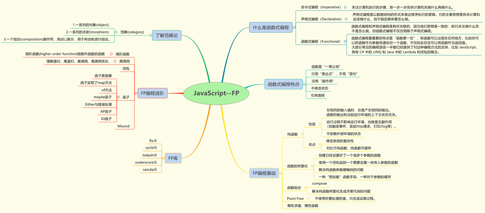

# JavaScript函数式编程超指南

 

学习函数式编程范式，相比较面向对象编程范式的另一个新天地，也是一种十分实用的编程方式。

对于学习JavaScript函数式编程作用的疑惑的解答：  
在复杂的Web应用中，底层的JavaScript代码实现细节很可能会使整个系统交织混杂在一起。函数式编程风格，提供了一种松耦合的应用组件组织方式，使系统在宏观上更易于设计、交互和维护。

所以，作为一个有梦想不甘当咸鱼的前端工程师来说，摆脱整天沉溺于丑陋的业务代码中，学习函数式编程是一条光明大道。

本文最佳的食用方式，以上是JavaScript函数式编程学习的引言，也是我写这个系列文章的初衷。具体的知识脉络将以章节文章的形式展现。下面是章节文章的目录，鉴于时间的关系，文章将逐步完善，请进来的同学点击已完成的文章阅读。

* [函数式编程——原来你也是编程范式][1]
* [函数式编程基础——范畴论][2]
* [FP编程基础之——纯函数][3] *未完成*  
* [FP编程基础之——函数柯里化][4] *未完成*  
* [FP编程基础之——偏函数][5] *未完成*  
* [FP编程基础之——函数组合][6] *未完成*  

下面是我认为FP中稍微有难度的知识点。

* [FP编程进阶之——Point-Free][7]  
* [FP编程进阶之——惰性求值、惰性函数、惰性链][8] *未完成*  
* [FP编程进阶之——高阶函数][9] *未完成*  
* [FP编程进阶之——递归和尾调用优化][10] *未完成*  
* [FP编程进阶之——容器、函子][11] *未完成*
* [FP编程进阶之——Monad][12] *未完成*  
* [FP编程进阶之——Functor、Applicative 和 Monad][13]  

[2]: https://github.com/Martin-Shao/yideng-note/blob/master/functional-programming/article/2019-1-18.md
[7]: https://github.com/Martin-Shao/yideng-note/blob/master/functional-programming/article/2019-1-19.md
[13]: https://github.com/Martin-Shao/yideng-note/blob/master/functional-programming/article/2019-1-20.md